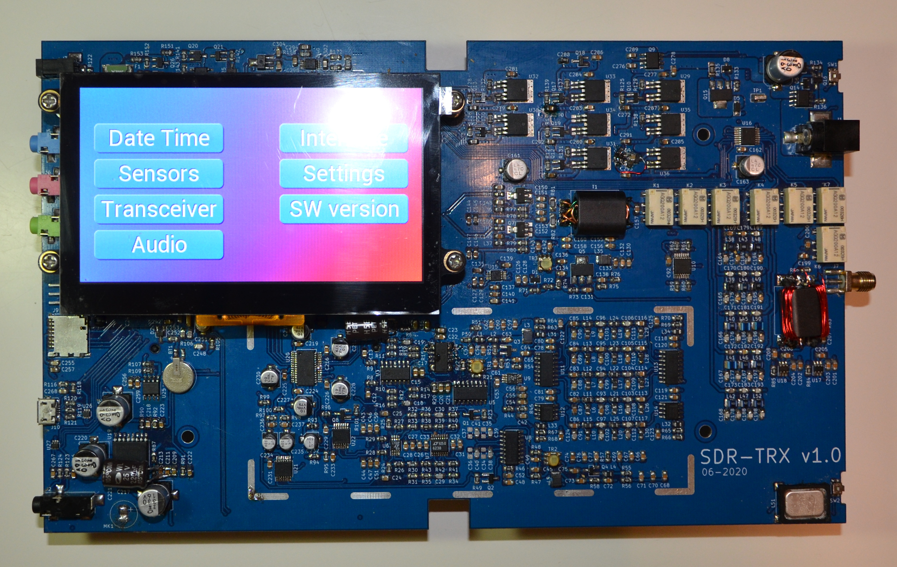

# SDR transceiver

## General info

- [SDR wiki](https://en.wikipedia.org/wiki/Software-defined_radio)
- [Quadrature Mixers, IQ Demodulation, and the Tayloe Detector](https://www.youtube.com/watch?v=JuuKF1RFvBM)
- [A Software-Defined Radio for the Masses, Part 1](https://www.arrl.org/files/file/Technology/tis/info/pdf/020708qex013.pdf)
- [Hardware Implementation of Software Radio Receivers](https://www.ripublication.com/irph/ijeee_spl/ijeeev7n4_08.pdf)

## Main concept

- Fully open source design include HW and SW
- Only free development SW
- Single board design to keep design simple
- SMT design
- Standalone battery powered device

## Folder structure

- **schematic/** - KiCad PCB design. Schematic, PCB routing, manufacture documentation.
- **simulation/** - HW components spice simulations.
- **firmware/** - firmware.
- **calculations/** - calculations and considerations needed for HW/SW design implementation.
- **datasheets/** - datasheets used during design implementations.
- **tests/** - projects to check design components functionality.

## Block diagram

See schematic/sdr-trx/sdr-trx.sch which is top level schematic.

## Great thanks for sharing their approaches knowledges and considerations

- M0NKA http://www.m0nka.co.uk/ - Small and inexpensive homebrew HF radio.
- https://www.flexradio.com/ - RF transceivers.
- https://elecraft.com/products/kx3-all-mode-160-6-m-transceiver - SDR transceiver.
- IN3OTD https://www.qsl.net/in3otd/index.html - lot of very useful information information and approaches. RF PA got from this site.
- https://ludens.cl/Electron/Electron.html - Here's the best explanation of common mistake in push-pull RF PA transformers design I've ever seen. See https://ludens.cl/Electron/mosfetamps/amps.html.
- https://www.youtube.com/watch?v=byF1FLdbUiA - Simple and understandable explanation of a directional coupler.
- https://rf-tools.com/lc-filter/ - Perfect on-line filter calculator.
